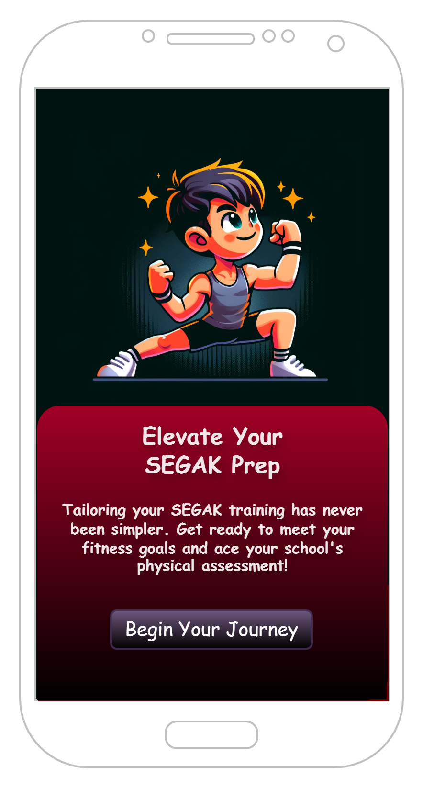
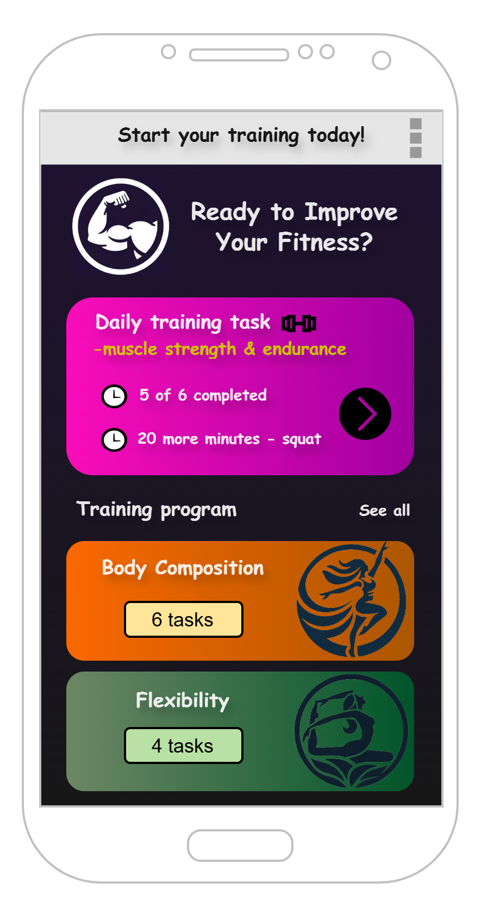
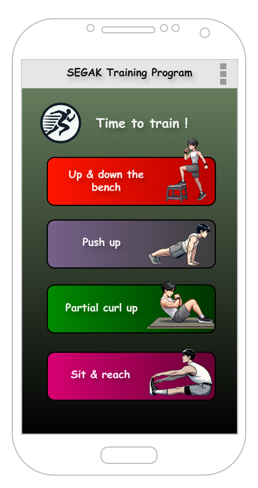
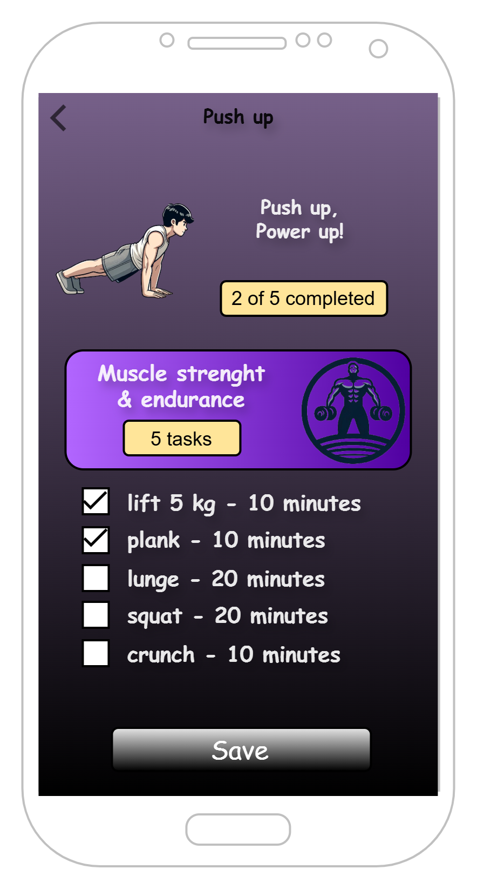
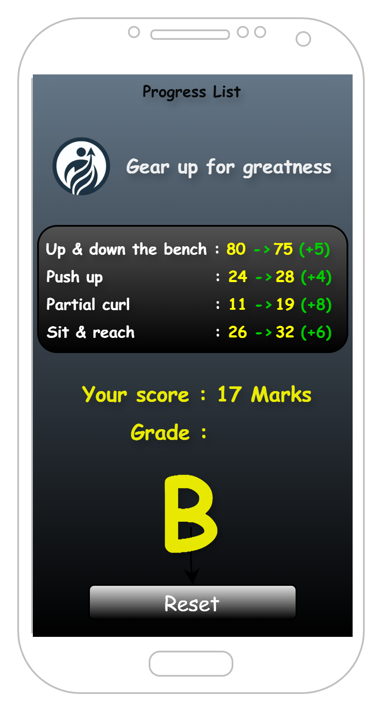

# SEGAK Tracker 🏃

> A cross-platform mobile app to help Malaysian students prepare for the **SEGAK** physical fitness assessment — and help teachers run practice sessions before the real test.


[](https://github.com/IkmalAzis/SEGAK-Tracker/actions/workflows/ci.yml)

---

## 📖 About

**SEGAK** (*Standard Kecergasan Fizikal Kebangsaan*) is Malaysia's national physical fitness standard, conducted in schools to assess students across several fitness components. The official test includes:

- **Up & down the bench** (step test — cardiovascular endurance)
- **Push-ups** (upper body muscular strength & endurance; modified push-ups for girls)
- **Partial curl-ups** (abdominal muscular strength & endurance)
- **Sit & reach** (flexibility)

**SEGAK Tracker** lets students record practice attempts, get their SEGAK score and grade instantly, follow a daily training checklist for each component, and track their improvement over time — so they can walk into the real assessment prepared instead of nervous. Teachers can use it to run structured practice sessions.

## ✨ Features

- **Score & grade calculator** — enter your four results; the app scores each test 1–5 using the SEGAK norms for your age (10–17) and gender, adds them up (4–20) and gives your grade (A–E).
- **Input validation** — catches typos such as a pulse of 9 or an age outside the SEGAK range before anything is saved.
- **Progress list** — first attempt vs latest attempt for each test (e.g. `Push up : 24 → 28 (+4)`), how far you are from the next score band, your latest score and grade, and the full attempt history. Delete a single attempt or reset everything (with confirmation).
- **Daily training programme** — one checklist per SEGAK test. Ticks are saved per day and start fresh every morning.
- **Home dashboard** — today's training progress, the next task to do and your latest grade.
- **Works offline** — all data stays on the device in a local SQLite database. The app requests no permissions.

## 📱 Screens

The screenshots below are the original design mockups the app is built from.

<table>
  <tr>
    <td align="center"><br/><sub><b>Onboarding</b></sub></td>
    <td align="center"><br/><sub><b>Home / Main Menu</b></sub></td>
    <td align="center"><br/><sub><b>Training Program</b></sub></td>
  </tr>
  <tr>
    <td align="center"><br/><sub><b>Exercise Detail</b></sub></td>
    <td align="center"><br/><sub><b>Progress & Grade</b></sub></td>
    <td></td>
  </tr>
</table>

## 🛠 Tech Stack

- **.NET MAUI 8.0** — single codebase targeting Android, iOS, Windows & macOS
- **C# / XAML** with **MVVM** ([CommunityToolkit.Mvvm](https://github.com/CommunityToolkit/dotnet)) and compiled bindings
- **SQLite** ([sqlite-net-pcl](https://github.com/praeclarum/sqlite-net)) for local storage
- **xUnit** unit tests and **GitHub Actions** CI (tests + Android build)

## 🗂 Project structure

| Project | What it contains |
|---|---|
| `SEGAK Tracker/` | The .NET MAUI app: XAML pages, Shell navigation, platform services (Preferences, dialogs, navigation) and DI setup in `MauiProgram.cs`. |
| `SegakTracker.Core/` | Platform-independent logic: models, SEGAK norm tables and scoring (`Scoring/`), SQLite repositories (`Data/`), training programmes (`Training/`) and view models (`ViewModels/`). |
| `SegakTracker.Tests/` | Unit tests for scoring, validation, persistence and every view model. |

Keeping the logic in `SegakTracker.Core` means it can be tested with the plain .NET SDK — no emulator or MAUI workload needed.

## 📏 SEGAK norms

All score cut-offs live in one file: [`SegakTracker.Core/Scoring/SegakNorms.cs`](SegakTracker.Core/Scoring/SegakNorms.cs), and the grade bands in [`SegakGrade.cs`](SegakTracker.Core/Scoring/SegakGrade.cs).

The values were compiled from publicly available copies of the KPM *Panduan SEGAK* tables. A few rows (girls aged 11, 13, 15 and 17, and boys aged 17) could not be confirmed and are **estimated** from neighbouring ages; they are marked `IsEstimated: true` and the app shows a notice when they are used. If you have the official booklet, correct the numbers in that file — `SegakNormsTests` checks that every row stays well-formed.

## ✅ Roadmap

**Done**
- [x] Cross-platform project setup (.NET MAUI, 4 target platforms)
- [x] Onboarding flow (shown on first launch only) & Shell flyout navigation
- [x] UI for all screens, following the design mockups
- [x] App icon, splash screen & exercise assets
- [x] Save logic for the Fitness Tracking input form
- [x] SEGAK score & grade calculation (age/gender-based standards)
- [x] Local data persistence (SQLite + Preferences)
- [x] Progress List driven by real saved data
- [x] Exercise detail / task-checklist screen wired to real state
- [x] Reset functionality
- [x] Input validation & error handling
- [x] Unit tests and CI

**Ideas for later**
- [ ] Verify the estimated norm rows against the official KPM booklet
- [ ] BMI (the fifth SEGAK component) with WHO BMI-for-age categories
- [ ] Teacher mode: multiple students per device and class export
- [ ] Upgrade to a currently supported .NET MAUI version (.NET MAUI 8 reached end of support in May 2025)
- [ ] Bahasa Melayu translation

## 🚀 Getting Started

**Requirements:** Visual Studio 2022 with the **.NET Multi-platform App UI development** workload installed.

```bash
git clone https://github.com/IkmalAzis/SEGAK-Tracker.git
```

Open `SEGAK Tracker.sln` in Visual Studio, set **SEGAK Tracker** as the startup project, select a target (e.g. Android emulator or Windows Machine), and run.

Run the unit tests from Test Explorer, or from a terminal with just the .NET 8 SDK:

```bash
dotnet test SegakTracker.Tests
```

## 🔒 Privacy

SEGAK Tracker has no accounts, no analytics and no network access. Scores, age and gender are stored only in the app's private storage on the device and are removed when the app is uninstalled (or with **Reset** on the Progress List). Android cloud backup is turned off so the data never leaves the device.

## 📝 Notes

This was originally built as a university Mobile Development coursework project and has been revisited and completed as a portfolio piece. The commit history reflects that ongoing development.

---

*Built by [Ikmal Azis](https://github.com/IkmalAzis) with .NET MAUI.*
